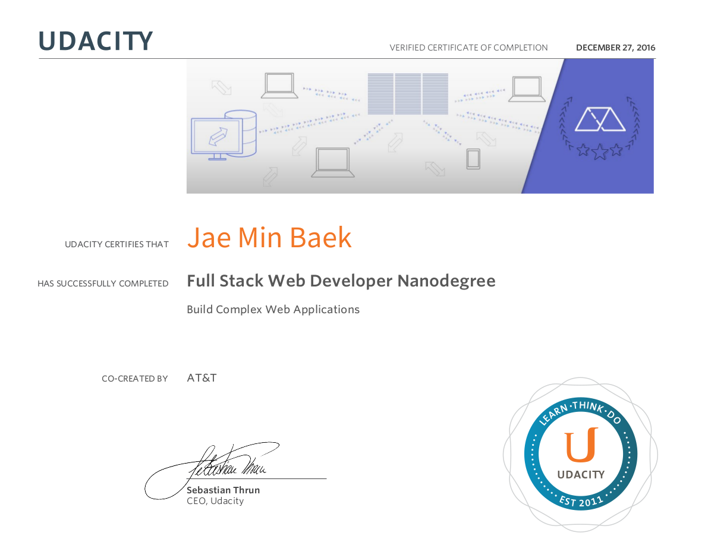

# Full Stack Web Developer Nanodegree 

## About [Full Stack Web Developer Nanodegree](https://www.udacity.com/course/nd004)

This program will prepare you for a job as a Full Stack Web Developer, and teach you to build complex server-side web applications that use powerful relational databases to persistently store data.

You’ll learn to build applications that can support any front-end, and scale to support hundreds of thousands of users.

Co-created by: AWS, GitHub, AT&T, Google

## Projects
- [**Project 1** - Movie Trailer Website](https://github.com/jbaek7023/Movie_Trailer)
- **Project 2** - Build a Portfolio Site
- [**Project 3** - Multi User Blog](https://github.com/jbaek7023/BlogPage)
- [**Project 4** - Tournament Results](https://github.com/jbaek7023/fullstack-nanodegree-vm)
- [**Project 5** - Item Catalog](https://github.com/jbaek7023/CatalogApp)
- **Project 6** - Neighborhood Map
- **Project 7** - Design a Game
- [**Project 8** - Linux Server Configuration](https://github.com/jbaek7023/LinuxConfiguration)

## Courses
- Programming Foundations with Python
- Intro to Backend
- Intro to Relational Databases
- Authentication & Authorization: OAuth
- Full Stack Foundations
- Intro to AJAX
- JavaScript Design Patterns
- Developing Scalable Apps with Python
- Linux Command Line Basics
- Configuring Linux Web Servers

